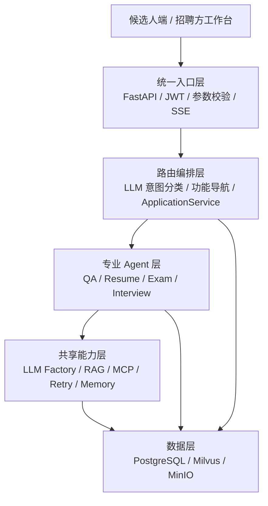

# 聘达智能招聘初筛多智能体系统开发文档

## 1. 文档说明

本文档描述聘达智能招聘初筛系统的业务规则、技术架构、数据模型、Agent 工作流、知识库、接口、安全、可靠性、部署和测试方案。系统面向企业 HR、用人部门和候选人，覆盖招聘答疑、简历投递与评审、在线笔试、AI 初面、人工复核、综合看板和最终通知。

系统采用 Python、FastAPI、LangChain、LangGraph、DeepSeek、MCP、BGE-M3、BGE-Reranker、Milvus、PostgreSQL、MinIO、SSE 和 JWT 构建。

## 2. 建设目标

系统解决以下问题：

- 招聘咨询重复度高，HR 需要反复回答岗位和流程问题；
- 简历数量大，人工筛选标准不统一且容易遗漏证据；
- 笔试组织和主观题批改成本高；
- 面试质量依赖面试官经验，难以稳定覆盖考察维度；
- 简历、笔试和面试结果分散，缺少统一业务主线；
- 大模型调用存在超时、结构化输出失败和结果不稳定问题；
- AI 评估涉及招聘决策，必须保留人工复核、审计和权限隔离。

系统目标是建立“候选人自助完成任务、Agent 辅助评估、招聘方人工决策”的初筛闭环。AI 只提供证据、评分和建议，最终录用或淘汰决定由有权限的招聘方作出。

## 3. 核心业务规则

### 3.1 招聘申请

招聘申请是候选人与岗位之间的一次业务关系，由 PostgreSQL 中的 `recruitment_applications` 记录表示，并通过 `application_id` 唯一标识。

```text
候选人 user_id + 岗位 position_id
                ↓
        招聘申请 application_id
                ├── 简历及评审结果
                ├── 笔试答卷及批改结果
                ├── 面试会话及评估报告
                └── HR 决策及通知记录
```

同一候选人可以申请多个岗位；同一候选人对同一岗位只保留一条有效申请，数据库通过唯一约束避免重复创建。

### 3.2 任务开放规则

候选人完成简历上传并关联招聘申请后，笔试和 AI 初面同时开放，两项任务相互独立，可以在各自窗口期内任意顺序完成。

简历 Agent 在后台异步解析和评审，其结果用于招聘方决策和面试个性化追问，不作为笔试、面试开放的前置条件。简历解析或模型评审异常时进入人工处理，不阻塞候选人继续完成任务。

### 3.3 结果可见性

- 候选人可以查看岗位、任务开放状态、截止时间、提交状态和 HR 最终通知；
- 候选人不能查看简历评分、笔试成绩、面试评分、评语、排名、内部报告和复核意见；
- 招聘方可以查看本租户、本岗位范围内的候选人材料和评估结果；
- 最终决定必须由招聘方确认，系统不得自动录用或淘汰候选人。

## 4. 五层系统架构



### 4.1 统一入口层

统一入口由 FastAPI 提供 REST 和 SSE 接口，负责：

- 使用 Pydantic 校验必填字段、字符串长度、UUID 和枚举类型；
- 从 `Authorization: Bearer <token>` 读取 JWT，完成身份认证；
- 根据角色、租户和资源归属执行权限校验；
- 拦截空输入、超长输入和非法请求；
- 对问候、感谢、道别、身份及功能询问等固定场景，通过精确匹配或正则返回零 Token 模板；
- 将其余自然语言请求交给路由编排层；
- 通过 SSE 持续推送状态、文本片段、操作选项和完成事件。

文件上传、笔试提交和面试回答使用专用业务接口，统一聊天入口不承载大文件或复杂结构化提交。

### 4.2 路由编排层

编排层使用低温度 LLM 将请求分类为：

```text
qa          招聘问答
resume      简历投递
exam        在线笔试
interview   AI 初面
multi_agent 多环节招聘需求
clarify     信息不足，需要澄清
```

分类结果包含 `label`、`agent_type`、`execution_mode` 和 `reason`。招聘问答直接进入 QA Agent；简历、笔试和面试意图返回相应功能选项，由前端显示对应选项卡，候选人进入后调用专用接口。多环节需求返回招聘工作台及当前可用任务。

`ApplicationService` 负责跨 Agent 的业务协调，包括创建申请、绑定结果、开放任务、窗口校验、状态更新、结果聚合和最终通知。编排层不承担简历评分、笔试批改和面试评估。

### 4.3 专业 Agent 层

四个 Agent 分别编译为 LangGraph 状态图：

- QA Agent：招聘问答、查询改写、知识检索和答案生成；
- Resume Agent：PDF 解析、结构化抽取、人岗匹配和六维评审；
- Exam Agent：在线答卷处理、三轨并行批改、结果汇总和人工复核；
- Interview Agent：多阶段问答、简历联动、知识库出题、动态追问和报告生成。

### 4.4 共享能力层

共享能力包括：

- LLM Factory：统一模型实例、超时、温度、流式模式和模型切换；
- RAG：文档解析、分块、Embedding、混合召回、融合和精排；
- MCP：统一封装知识检索和联网搜索工具；
- Retry/Fallback：模型重试、Agent 降级和系统兜底；
- Memory：滑动窗口、摘要压缩和 Checkpointer；
- Logging：结构化日志、链路标识和错误审计。

### 4.5 数据层

- PostgreSQL：用户、岗位、申请、任务状态、答卷、会话、评分、报告、复核、通知和审计；
- Milvus：知识文档分块的 Dense/Sparse 向量及检索元数据；
- MinIO：原始简历、招聘资料、图片和其他附件；
- LangGraph PostgreSQL Checkpointer：按 `thread_id` 保存和恢复 Agent State。

## 5. 关键标识设计

| 标识 | 含义 | 主要用途 |
|---|---|---|
| `user_id` | 用户唯一标识 | 确认候选人或招聘方身份 |
| `tenant_id` | 企业租户标识 | 企业间数据隔离 |
| `position_id` | 岗位唯一标识 | 关联 JD、题库和候选人 |
| `application_id` | 招聘申请唯一标识 | 串联简历、笔试、面试和决策 |
| `session_id` | 前端业务会话标识 | 标识一次问答或面试会话 |
| `thread_id` | LangGraph 检查点索引 | 保存和恢复某个 Agent 的 State |
| `request_id` | 请求幂等键 | 防止重复提交产生副作用 |

`application_id` 表达业务关系，`thread_id` 表达 Agent 执行上下文，两者不能互相替代。一个申请可以关联多个不同 Agent 的线程。

## 6. 招聘业务状态机

### 6.1 申请及子任务状态

申请主状态只表达总体进度：

```text
created → screening → completed → decided
                    ↘ withdrawn
```

各子任务独立维护状态：

```text
resume_status:    uploaded → parsing → reviewing → completed / manual_review
exam_status:      available → in_progress → submitted → grading → pending_review → completed
interview_status: available → in_progress → submitted → evaluating → pending_review → completed
```

简历上传事务同时完成：

```sql
resume_status = 'uploaded',
exam_status = 'available',
interview_status = 'available'
```

这是一组数据库状态更新，不代表系统立即替候选人执行笔试或面试。

### 6.2 合法状态转换

业务服务对每个动作执行前置状态检查。例如笔试只有在 `available` 时才能开始，只有在 `in_progress` 时才能提交，只有 `pending_review` 才能由招聘方复核。

状态更新使用事务和条件更新：

```sql
UPDATE recruitment_applications
SET exam_status = 'submitted', updated_at = NOW()
WHERE id = :application_id
  AND candidate_id = :candidate_id
  AND exam_status = 'in_progress';
```

受影响行数为零表示状态不允许、资源不属于当前用户，或请求已经处理。

## 7. 数据模型

### 7.1 岗位表

```sql
CREATE TABLE job_positions (
    id UUID PRIMARY KEY,
    tenant_id VARCHAR(64) NOT NULL,
    title VARCHAR(128) NOT NULL,
    department VARCHAR(128),
    jd_text TEXT NOT NULL,
    requirements JSONB NOT NULL DEFAULT '{}',
    exam_id UUID,
    status VARCHAR(16) NOT NULL,
    apply_deadline TIMESTAMPTZ,
    created_by UUID NOT NULL,
    created_at TIMESTAMPTZ NOT NULL DEFAULT NOW(),
    updated_at TIMESTAMPTZ NOT NULL DEFAULT NOW()
);
```

### 7.2 招聘申请表

```sql
CREATE TABLE recruitment_applications (
    id UUID PRIMARY KEY,
    tenant_id VARCHAR(64) NOT NULL,
    position_id UUID NOT NULL REFERENCES job_positions(id),
    candidate_id UUID NOT NULL REFERENCES users(id),
    resume_review_id UUID,
    exam_submission_id UUID,
    interview_session_id UUID,
    status VARCHAR(24) NOT NULL,
    resume_status VARCHAR(24) NOT NULL,
    exam_status VARCHAR(24) NOT NULL,
    interview_status VARCHAR(24) NOT NULL,
    exam_open_at TIMESTAMPTZ,
    exam_deadline TIMESTAMPTZ,
    interview_open_at TIMESTAMPTZ,
    interview_deadline TIMESTAMPTZ,
    final_decision VARCHAR(24),
    created_at TIMESTAMPTZ NOT NULL DEFAULT NOW(),
    updated_at TIMESTAMPTZ NOT NULL DEFAULT NOW(),
    UNIQUE (tenant_id, position_id, candidate_id)
);
```

### 7.3 结果和审计表

```text
resume_reviews          简历原文、结构化字段、六维评分和证据
exam_submissions        答卷、逐题 AI 分数、最终分数和批改状态
exam_review_records     人工复核前后分数、原因和操作人
interview_sessions      面试阶段、进度和线程标识
interview_messages      问题、回答、评分要点和检索证据
interview_reports       维度评价、优势、风险和综合建议
decision_audits         最终决策、备注、操作人和时间
notifications           通知类型、接收人、内容和幂等键
knowledge_documents     文档元数据、版本、哈希和解析状态
```

## 8. QA Agent

### 8.1 状态与流程

QA State 保存用户问题、问题范围、查询类型、改写查询、检索文档、置信度、生成答案、最近消息和历史摘要。

```text
输入校验
  ↓
领域关键词快速通道
  ↓ 未命中
MiniLM 二分类：general / specialized
  ├── general → 通用回答或能力边界提示
  └── specialized
          ↓
     LLM 细分：PRECISE / VAGUE / BROAD
          ├── PRECISE → 原问题直接检索
          ├── VAGUE   → HyDE 扩展后检索
          └── BROAD   → Multi-Query 拆分并行检索
                         ↓
             Hybrid Search → Reranker → 置信度路由
                         ↓
                 RAG 生成 / Web 补充 / 直答
```

MiniLM 只负责 `general/specialized` 二分类，不负责查询改写。HyDE 和 Multi-Query 均由 LLM 节点生成。

### 8.2 混合检索

BGE-M3 对查询一次编码，同时生成：

- Dense 向量：处理语义相似和同义表达；
- Sparse 向量：处理技术名词、岗位名称和精确关键词。

Milvus 在相同元数据过滤条件下并行执行两路召回，使用 `WeightedRanker` 融合，再由 BGE-Reranker 对 Query-Chunk 文本对进行二次打分。

```text
岗位/租户/文档类型元数据过滤
              ↓
   Dense Search || Sparse Search
              ↓
       WeightedRanker 融合
              ↓
        BGE-Reranker 精排
              ↓
     Top-K 文档 + 检索置信度
```

### 8.3 低置信度处理

检索结果低于阈值时，不强行基于无关文档回答。启用联网搜索时通过 MCP 获取补充信息，再由 LLM 生成带风险提示的回答；未启用联网时使用通用知识直答并明确知识边界。同时记录低置信度问题，供知识运营人员补充知识库。

## 9. Resume Agent

### 9.1 状态图

```text
校验申请与文件
  → 从 MinIO 下载文件
  → PDF 版面解析/OCR
  → 文本清洗与阅读顺序恢复
  → LLM Structured Output
  → Pydantic 校验
  → 六维并行评审
  → 汇总报告
  → 结果落库
```

### 9.2 文档解析

原始简历保存到 MinIO。解析器按文件类型选择处理链路：

- 文本型 PDF：使用 PyMuPDF 提取文本块、坐标和页码；
- 双栏 PDF：依据横坐标划分左右栏，分别按纵坐标排序后合并；
- 扫描 PDF：页面渲染为图片，使用 OCR 提取文本并根据坐标恢复顺序；
- 复杂版式：使用 MinerU 识别标题、正文、表格、图片、公式和阅读顺序；
- 表格：转换为 Markdown/JSON，并通过表头和列结构合并跨页表格；
- 图片简历：OCR 提取文字，多模态模型补充图表和结构关系。

每个解析块保存页码、坐标、内容类型和来源，保证评审证据可追溯。

### 9.3 结构化抽取

清洗后的文本通过 `with_structured_output` 或 Function Calling 输出 `ResumeStructured`：

```python
class ResumeStructured(BaseModel):
    name: str
    contact: ContactInfo
    education: list[Education]
    work_experience: list[WorkExperience]
    projects: list[ProjectExperience]
    skills: list[str]
    certificates: list[str]
```

Pydantic 校验字段类型和必填项。结构化输出为空、JSON 无法解析或字段不合法时自动重试，仍失败则保存原始材料并进入人工处理。

### 9.4 六维并行评审

结构化简历与岗位 JD 共同输入六个评审任务：

1. 基础条件；
2. 核心技能匹配；
3. 项目相关性和技术深度；
4. 工作经历匹配；
5. 成果可信度；
6. 表达完整性与风险。

六个任务通过 `asyncio.gather(return_exceptions=True)` 并行执行。每个维度返回分数、理由、证据、置信度和风险项。单维度异常不会阻塞其他维度，汇总时将失败维度标记为人工复核，禁止用默认中间分冒充模型结论。

## 10. Exam Agent

### 10.1 状态图

```text
加载岗位试卷
  → 创建/恢复答题任务
  → 保存候选人答案
  → 校验完整性和截止时间
  → 按题型分组
  → 三轨并行批改
  → 汇总分数和薄弱项
  → interrupt 等待人工复核
  → 确认最终成绩
  → 结果落库
```

### 10.2 三轨并行批改

三轨指三种题型处理链路：

- 第一轨：客观题规则引擎，按照标准答案精确匹配；
- 第二轨：简答题 LLM 评分，根据参考答案和评分要点输出分数、评语及置信度；
- 第三轨：代码题 LLM 评估，从正确性、完整性、复杂度和代码质量等维度评价。

```python
objective, subjective, coding = await asyncio.gather(
    grade_objective(objective_questions),
    grade_subjective(subjective_questions),
    grade_code(code_questions),
    return_exceptions=True,
)
```

三轨互不阻塞，失败轨道进入人工处理。人工复核是三轨完成后的 Human-in-the-Loop 环节，不属于第三轨。

### 10.3 人工复核

以下结果进入复核：

- LLM 评分置信度低于阈值；
- 结构化输出异常或评分点缺失；
- 代码题需要运行环境或安全判断；
- 单轨执行失败；
- 命中作弊、敏感或高风险规则；
- 招聘方主动抽检。

LangGraph 在 `interrupt()` 暂停，Checkpointer 保存 State。招聘方提交修正分数和理由后，通过 `Command(resume=...)` 恢复流程，系统计算最终分数并保留 AI 原结果与人工修改记录。

## 11. Interview Agent

### 11.1 多阶段状态机

```text
初始化
 → 破冰与背景确认
 → 技术基础
 → 项目深挖
 → 行为与协作
 → 候选人提问
 → 汇总评估
```

State 保存 `application_id`、岗位 JD、结构化简历、当前阶段、已问题目、本轮回答、检索题目、评分要点、阶段摘要、最近消息和评估结果。

### 11.2 简历联动

面试 Agent 使用 `application_id` 查询 Resume Agent 已保存的结构化信息，提取候选人的技能、项目、职责和量化成果，再结合岗位要求生成针对性问题。例如简历提到 Milvus 混合检索，项目深挖阶段会继续考察召回策略、融合方法、效果评估和异常处理。

### 11.3 从知识库检索题目

每轮根据岗位、当前阶段、简历技能和上一轮回答构造查询。通过 MCP 调用 Milvus 检索工具，先按 `tenant_id`、`position_id`、题目类型、阶段和难度过滤，再并行执行 Dense/Sparse 召回，融合并精排。

系统过滤已问题目，选取包含评分要点的候选题；LLM 再结合简历和历史回答改写为自然、具体的追问。展示给候选人的只有问题，标准答案和评分要点只在内部 State 和业务表中使用。

### 11.4 双轨评估

每轮回答同时从两个角度评估：

- 内容轨：技术正确性、完整性、深度和证据；
- 表达轨：逻辑结构、沟通清晰度、真实性和风险。

阶段结束后生成摘要，面试结束后按照岗位能力模型汇总维度表现、优势、风险、证据和综合建议。系统不直接生成录用决定。

## 12. 记忆管理

### 12.1 State、窗口和摘要

LangGraph State 是节点之间传递的运行时数据结构。它包含最近消息、摘要、当前阶段、已问题目和中间结果，但不把无限增长的全部历史持续放入模型上下文。

模型输入由三部分组成：

```text
系统提示词 + 历史摘要 + 最近 N 轮消息 + 当前业务上下文
```

滑动窗口使用 LangChain `trim_messages` 按 Token 截断，保留系统消息和最近完整对话轮次。达到消息数或 Token 阈值时，LangGraph 路由到摘要节点，由 LLM 将旧消息压缩为结构化摘要，保留阶段、关键回答、证据、已考察点、风险和待追问项。

### 12.2 Checkpointer 与业务持久化

图使用 PostgreSQL Checkpointer 编译：

```python
graph = workflow.compile(checkpointer=postgres_saver)
config = {"configurable": {"thread_id": thread_id}}
await graph.ainvoke(input_state, config=config)
```

Checkpointer 按 `thread_id` 保存和恢复整个 State。正式业务数据同时按 `application_id` 写入普通业务表：Checkpointer 用于恢复流程，业务表用于看板查询、审计和统计。

## 13. MCP 工具设计

MCP 将外部能力封装为标准工具，Agent 不直接依赖具体数据库或搜索服务。

### 13.1 知识检索工具

```json
{
  "name": "search_recruitment_knowledge",
  "arguments": {
    "query": "Milvus 混合检索",
    "tenant_id": "tenant-a",
    "position_id": "position-uuid",
    "document_types": ["question_bank", "position_jd"],
    "top_k": 10
  }
}
```

工具内部完成向量编码、Milvus 过滤、混合召回、融合、精排和来源组装，返回内容、分数、文档 ID、页码和标题路径。

### 13.2 联网搜索工具

联网搜索只在配置允许且知识库低置信度时启用。搜索结果必须标记外部来源，不能覆盖企业招聘制度等内部权威信息。

### 13.3 工具安全

- 使用 Pydantic/JSON Schema 校验工具参数；
- 从认证上下文注入 `tenant_id`，不信任模型自行生成租户；
- 设置超时、结果数量和内容长度限制；
- 对工具调用记录 Trace ID、耗时和错误类型；
- 写操作工具需要明确权限和幂等键。

## 14. 三层容错

### 14.1 第一层：调用级自动重试

模型超时、连接重置和可重试服务错误采用最多三次调用，退避间隔为 1 秒、3 秒，并设置单次超时。参数错误、鉴权失败等不可重试错误立即返回。

### 14.2 第二层：Agent 级降级

- QA：RAG 工具失败时转为受限直答，并提示知识边界；
- Resume：保留原始文件和已提取文本，失败维度进入人工处理；
- Exam：客观题正常判分，失败的主观题或代码题标记待复核；
- Interview：保留阶段和历史，动态出题失败时使用知识库原始题或岗位基础题，无法评分的回答进入人工复核。

### 14.3 第三层：系统级兜底

Agent 无法返回可靠结果时，统一异常处理中间件返回可识别错误码、可重试状态和用户友好信息，同时保存业务状态、请求 ID 和错误日志。系统不得返回伪造分数或把异常默认值当作正常结论。

## 15. 幂等与并发控制

需要保证幂等的操作包括创建申请、上传简历、提交答卷、开始面试、人工复核、最终决策和发送通知。

实现组合如下：

- 请求头携带 `Idempotency-Key`；
- 业务表建立唯一约束；
- 状态流转使用带原状态的条件更新；
- 关键写操作置于同一数据库事务；
- 消息或通知使用业务幂等键；
- 会话按唯一 `thread_id` Upsert；
- 数据库迁移使用 `IF NOT EXISTS`。

例如笔试重复提交时，以 `application_id + task_type + attempt_no` 建立唯一约束。服务端检测到相同幂等键后返回第一次的提交结果，不重复创建批改任务。

## 16. 权限与安全

### 16.1 JWT 鉴权

登录时校验密码哈希，使用 HS256 签发包含 `sub`、`role`、`tenant_id` 和过期时间的 Access Token。请求通过 Bearer Token 携带，`get_current_user` 验证签名、过期时间和用户状态。

JWT 只解决“用户是谁”，资源接口还必须执行：

```text
角色校验 + tenant_id 校验 + 资源归属校验
```

### 16.2 权限矩阵

| 资源 | 候选人 | 招聘方 | 管理员 |
|---|---|---|---|
| 自己的任务和截止时间 | 可读 | 可读 | 可读 |
| 自己的简历、答卷和回答 | 可提交 | 可读 | 可读 |
| 简历评审报告 | 禁止 | 本租户可读 | 可读 |
| 笔试评分和复核记录 | 禁止 | 本租户可读写 | 可读写 |
| 面试报告和原始记录 | 禁止 | 本租户可读写 | 可读写 |
| 候选人排名 | 禁止 | 本租户可读 | 可读 |
| 最终决策 | 仅接收通知 | 有权限岗位可写 | 可写 |

MinIO 文件通过服务端鉴权后下载或使用短期签名 URL，Milvus 检索强制附加租户和岗位过滤条件。

## 17. 知识库建设

### 17.1 文档类型

```text
position_jd     岗位说明和能力要求
policy          招聘制度及流程
company         企业介绍和用人信息
faq             招聘常见问题
question_bank   笔试题、面试题和评分要点
```

结构化题目主体保存在 PostgreSQL，便于按照岗位、难度、阶段和题型精确筛选；题目说明、评分规范和扩展材料同时向量化进入 Milvus，支持语义检索。二者通过 `question_id` 关联。

### 17.2 企业级解析流程

```text
上传 MinIO
 → 文件类型和病毒检查
 → 文本/版面/OCR/多模态解析
 → 标题层级与阅读顺序恢复
 → 表格和图片结构化
 → 清洗、去重和质量校验
 → Parent-Child/语义分块
 → BGE-M3 Dense+Sparse 编码
 → 写入 Milvus
 → 抽样验收并发布版本
```

每个 Chunk 保存 `tenant_id`、`position_id`、`document_id`、版本、文档类型、标题路径、页码、内容类型、权限范围和文件哈希。重复导入使用稳定文档 ID 更新原版本，避免产生重复向量。

## 18. API 设计

### 18.1 认证和统一入口

```text
POST /api/v1/auth/login
POST /api/v1/unified-chat/stream
POST /api/v1/qa/chat/stream
```

### 18.2 候选人接口

```text
GET  /api/v1/positions
POST /api/v1/applications
GET  /api/v1/applications/{id}/tasks
POST /api/v1/applications/{id}/resume
GET  /api/v1/exam/online/{application_id}
POST /api/v1/exam/online/submit
POST /api/v1/interview/sessions
POST /api/v1/interview/sessions/{id}/chat/stream
GET  /api/v1/notifications
```

候选人提交接口只返回任务 ID、处理状态和提示，不返回内部评分字段。

### 18.3 招聘方接口

```text
GET  /api/v1/recruiter/applications
GET  /api/v1/recruiter/applications/{id}
POST /api/v1/recruiter/applications/{id}/resume-decision
GET  /api/v1/exam/pending-reviews
POST /api/v1/exam/submissions/{id}/confirm
POST /api/v1/recruiter/applications/{id}/interview-review
POST /api/v1/recruiter/applications/{id}/decision
POST /api/v1/recruiter/positions
POST /api/v1/recruiter/knowledge-documents
```

## 19. 前端设计

### 19.1 候选人端

- 岗位列表和详情；
- 创建申请及上传简历；
- 招聘智能问答；
- 笔试和 AI 初面任务卡；
- 截止时间、任务状态和完成提示；
- HR 最终通知。

### 19.2 招聘方工作台

- 岗位管理和知识文档上传；
- 候选人列表、筛选和排序；
- 简历、笔试和面试结果聚合详情；
- 简历、笔试和面试人工复核；
- 最终决定和操作审计；
- 低置信度问答、模型异常和知识库质量看板。

前端隐藏功能不是权限控制，所有敏感接口均在后端再次鉴权。

## 20. 异步任务与实时反馈

简历解析、多维评审、笔试批改、面试报告和知识库构建均以异步任务执行。上传接口先完成文件保存和任务建档并返回 `task_id`，后台推进状态。

前端通过 SSE 接收：

```text
accepted    请求已接受
progress    当前处理阶段
token       流式文本片段
action      可用选项卡或操作
completed   处理完成
error       可识别错误及是否可重试
```

SSE 断开不会取消后台业务任务；客户端使用任务查询接口恢复最新状态。

## 21. 缓存与资源复用

- `get_settings()` 使用 `lru_cache` 复用配置对象；
- LLM Factory 按模型、温度和流式参数缓存客户端；
- Orchestrator 懒加载并缓存编译后的 Agent 图；
- MiniLM、BGE-M3 和 BGE-Reranker 以进程内单例加载；
- Milvus、PostgreSQL 和对象存储客户端复用连接池；
- Redis 缓存热点岗位、招聘 FAQ 和短期任务状态，并通过 TTL 与版本号失效；
- Checkpointer 保存会话状态，不作为通用业务缓存。

## 22. 可观测性

每个请求生成 `trace_id`，日志携带 `request_id`、`application_id`、`thread_id`、`agent_type`、节点、模型、耗时、重试次数和降级类型，禁止记录密码、Token 和完整敏感简历。

核心指标包括：

- API QPS、P50/P95/P99 延迟和错误率；
- LLM 首 Token 延迟、总耗时、Token 用量和失败率；
- RAG Recall@K、MRR、重排命中率、忠实度和低置信度比例；
- 简历解析成功率、结构化字段准确率和人工复核率；
- 笔试自动批改覆盖率、AI 与人工分差、复核率；
- 面试完成率、中断恢复率和重复问题率；
- 通知成功率、重复通知数和状态积压量。

## 23. 部署架构

```text
Nginx / API Gateway
        ↓
FastAPI 多实例
        ├── PostgreSQL
        ├── Redis
        ├── Milvus → etcd + MinIO
        ├── 对象存储 MinIO
        ├── 异步任务 Worker
        └── DeepSeek / 本地模型
```

容器通过 Docker Compose 管理本地及测试环境。生产环境将密钥放入环境变量或 Secret Manager，数据库执行定期备份，MinIO 开启版本与生命周期管理，服务设置健康检查、资源限制和滚动发布。

## 24. 测试方案

### 24.1 单元测试

- Pydantic 请求和结构化输出校验；
- 意图分类标签合法性及失败兜底；
- 申请状态转换和任务窗口；
- 六维评审异常隔离；
- 三轨批改与人工复核触发条件；
- 查询改写、结果去重和置信度路由；
- JWT、角色、租户和资源归属；
- 幂等键、唯一约束和并发提交。

### 24.2 Agent 测试

| Agent | 核心验收点 |
|---|---|
| QA | 分类正确、引用可追溯、未知内容不编造 |
| Resume | 字段提取准确、JD 联动、单维失败不影响整体 |
| Exam | 客观题确定、三轨隔离、复核可暂停恢复 |
| Interview | 简历联动、不重复提问、阶段推进和恢复正常 |

### 24.3 端到端测试

```text
候选人注册/登录
 → 查看岗位并创建申请
 → 上传简历
 → 笔试和初面同时开放
 → 在线提交笔试
 → 完成多轮 AI 初面
 → 招聘方处理低置信度结果
 → 看板聚合简历、笔试和面试报告
 → HR 作出决定
 → 候选人收到通知
```

同时覆盖模型超时、扫描件、SSE 断线、重复提交、越权访问、任务过期、服务重启和 Checkpointer 恢复。

## 25. 效果评估

离线构建带人工标注的岗位问答、简历匹配、主观题和面试回答数据集；线上采用抽样复核和指标监控。

- RAG：Recall@K、MRR、答案忠实度、答案相关性、引用准确率；
- 简历：字段级 Precision/Recall/F1、评分与 HR 一致性、漏筛率；
- 笔试：客观题准确率、主观题与人工分差、复核命中率；
- 面试：维度覆盖率、重复问题率、报告与面试官一致性；
- 工程：成功率、延迟、恢复率、单位任务 Token 成本；
- 业务：初筛耗时、人均处理量、HR 复核耗时和候选人完成率。

所有阈值均通过验证集和线上数据校准，不使用模型自报置信度直接代替真实评估。

## 26. 代码结构

```text
backend/
├── api/v1/
│   ├── auth.py
│   ├── unified_chat.py
│   ├── applications.py
│   ├── recruiter.py
│   ├── qa.py
│   ├── resume.py
│   ├── exam.py
│   └── interview.py
├── agents/
│   ├── qa/{state,prompts,nodes,graph}.py
│   ├── resume/{state,prompts,nodes,graph}.py
│   ├── exam/{state,prompts,nodes,graph}.py
│   └── interview/{state,prompts,nodes,graph}.py
├── core/
│   ├── application_service.py
│   ├── orchestrator.py
│   ├── llm_factory.py
│   ├── knowledge_base.py
│   ├── query_classifier.py
│   ├── reranker.py
│   ├── memory.py
│   ├── retry.py
│   └── object_storage.py
├── mcp/
├── db/
└── models/

frontend/src/
├── views/candidate/
├── views/recruiter/
├── stores/
├── api/
└── router/
```

## 27. 验收标准

- 四个 Agent 均以独立 LangGraph 状态图运行；
- 简历上传后笔试和初面同时开放且互不依赖；
- 面试可以读取结构化简历并形成针对性追问；
- RAG 支持分类、改写、Dense/Sparse 混合召回和精排；
- 笔试三轨并行，低置信度和异常结果可以人工复核；
- 所有 Agent 状态可通过 PostgreSQL Checkpointer 恢复；
- 候选人无法通过前端或直接请求读取内部评估结果；
- 招聘方只能访问授权租户和岗位数据；
- 重复提交不会产生重复申请、答卷、决策或通知；
- 模型和工具异常时保留业务状态，不输出伪造结论；
- 招聘方看板能够按申请聚合简历、笔试、面试和审计记录；
- 最终招聘决定只由有权限的招聘方提交并通知候选人。

